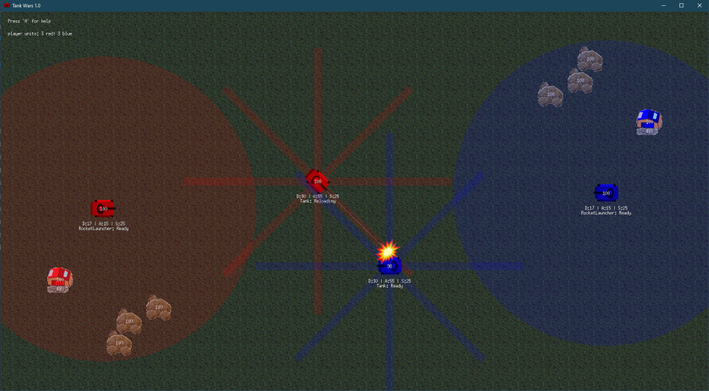

# TankWars

TankWars is a GO implementation of a programming challenge to create an AI that plays the game
like [CloudWars](https://github.com/SchnorcherSepp/CloudWars)
or [SpaceBumper](https://github.com/SchnorcherSepp/SpaceBumper).



## Summary

The assignment is to create an Artificial Intelligence (AI) that plays the game called "TankWars", described here.

There are two players (red and blue) each controlling a side of multiple units (tanks) and buildings (base).
The base slowly generates cash and spawns new units. The player can assemble personalized tanks.
Tanks can move around the field and fire projectiles at other objects (tanks, buildings, rocks, ...) and destroy them.

The game ends when the opponent no longer controls any tanks or buildings.

## How to compete

Download the GO source from [Github](https://github.com/SchnorcherSepp/TankWars/) or the fully compiled binaries from
the [release page](https://github.com/SchnorcherSepp/TankWars/releases). The simulator will act as a TCP/IP game server
and simulate and visualize the game according to the formal game rules, found below.

Each player AI is a separate application written in
the [language of your choice](examples/) that connects to the
simulator via TCP/IP. The clients (player AIs) and server communicate via a simple ASCII protocol over the connection.
This protocol is described in the network protocol specification.

The simulator supports several game modes (AI vs AI, AI vs Human). Feel free to try or train your AI against human
players or AI's made by others entering the competition ahead of the compo tournament.
Press _h_ in the GUI for more details on playing as a human.

The source code for the simulator is also provided. Feel free to modify it to accommodate any type of testing process
you prefer. You are also free to create your own simulator from scratch, if you wish to do so.

## Formal game rules

### Game initialization

- The game is played in a 2D coordinate system. Default is a size of 1792 x 960 units.
- 64-bit float values are used to represent positions and dimensions within this coordinate system.
- All destructible objects are managed in the background as a _tank_. They differ to which _owner_ they are assigned.
- Actively controlled tanks are owner _red_ and _blue_.
- There are also passive buildings that can be assigned to a player (_red_base_, _red_rock_, _neutral_rock_, _blue_rock_
  and _blue_base_).
- In the game logic, each object is treated as a perfect circle, even if the visual representation in the simulator is
  not always a perfect circle.
- The game is initialized by predefined maps (see
  [Fortress](maps/Map_Fortress.png),
  [Field](maps/Map_OpenField.png) or
  [Random](maps/Map_RandomWorld.png))
- Each tank has the many properties in the simulator (see _TankStatus_ for the list).
- The simulator acts as a TCP/IP server, while the players act as TCP/IP clients that connect to the server. Clients for
  this protocol are implemented in the [example code](examples/).
- The game is executed in iterations. When the game starts, the iteration index is zero.
- After the initialization procedure described in the protocol, the simulator then enters a loop executing iterations of
  the game logic until the game is finished.
- The game runs in "real time" with seemingly smooth movements when visualized. However, internally, the simulator runs
  discrete iterations of the game logic, typically locked to 30 iterations per second. What happens for each iteration
  is described below.

### Game iteration loop

For each tank in the world:

1) If the command is 1 or -1 the position is updated with `speed * MovePerTick`.
2) If the tank collides with the world border, the movement is stopped and the `isBlocked` flag is set.
3) If the tank collides with another object, the movement is stopped and the `isBlocked` flag is set.
4) The tank's macro function is called if set.

For each projectile in the world:

1) The position is updated with `speed * MovePerTick`.
2) If the projectile can collide and collides with another object, the projectile will explode and the damage
   calculation happens.
3) Is the maximum range reached, the projectile will explode and the damage calculation happens.
4) An object loses `damage - armor` HP, but at least 1 HP on hit.

General things:

- The player gets `1/36` cash per iteration if his base exists.

### Winning conditions

A player wins when his opponent runs out of units (see `unitCountRed` and `unitCountBlue`).

## Weapon types

The main difficulty of the game, apart from the positioning of its units, are the different types of weapons that are
available. The armor, damage and speed attributes can also be configured individually for each weapon type.

Each tank has 100 points (see `tankBudget`) for its attributes:

- **armor**: Each armor point reduces a damage point when hit. However, there is _1_ minimum damage.
  The value must be between `minArmor` and `maxArmor`.
- **damage**: Each point increases weapon damage. The individual weapon types affect this value with multipliers.
  The value must be between `minDamage` and `maxDamage`.
- **speed**: The value is determined indirectly by converting all unused points into speed.
  The speed is increased by a factor to be able to build very fast light
  units: `speedFactor = pow(speed-minSpeed, 6) * 0.0000000007`.
  The value must be greater than `minSpeed`.

### Battle Tank

The Battle Tank is the strongest unit on the field. Its +50% damage multiplier can destroy light units in one hit.
However, he can only shoot in movement direction his range is limited. His projectile cannot shoot over objects.

| _attribute_              | _value_                |
|--------------------------|------------------------|
| **range**                | 338 pxl                |
| **preparation time**     | 24 ticks (~ 800 ms)    |
| **reload time**          | 90 ticks (~ 3000 ms)   |
| **projectile speed**     | 600 (very fast)        |
| **damage**               | _baseDamage_ * **1.5** |
| **AoE radius**           | 0                      |
| **projectile collision** | true                   |
| **any fire angle**       | false                  |

### Rocket Launcher

The rocket launcher takes a long time to prepare after moving, but can then unleash a veritable inferno.
The damage from each projectile is small, but the rate of fire is impressive.
Its ability to shoot over objects makes it ideal as a second line behind the battle tanks.

| _attribute_              | _value_                                           |
|--------------------------|---------------------------------------------------|
| **range**                | 387 pxl                                           |
| **preparation time**     | 240 ticks (~ 8000 ms)                             |
| **reload time**          | from **60** to **18 ticks** based on _baseDamage_ |
| **projectile speed**     | 300 (fast)                                        |
| **damage**               | from **4** to **20** based on _baseDamage_        |
| **AoE radius**           | 64 pxl                                            |
| **projectile collision** | false                                             |
| **any fire angle**       | **true**                                          |

### Artillery

The artillery has a very long range and area damage. It is ideal for breaking down strong defenses.

| _attribute_              | _value_                |
|--------------------------|------------------------|
| **range**                | 736 pxl                |
| **preparation time**     | 240 ticks (~ 8000 ms)  |
| **reload time**          | 180 ticks (~ 6000 ms)  |
| **projectile speed**     | 300 (fast)             |
| **damage**               | _baseDamage_ * **0.6** |
| **AoE radius**           | 112 pxl                |
| **projectile collision** | false                  |
| **any fire angle**       | **true**               |

# Network protocol specification

## General conventions

1) The client sends a command to the server as a single line of text.
2) The line begins with a command, followed by its parameters, separated by one spaces `' '`.
3) The server responds by sending a single line of text.
4) A line of text must always be a string of ASCII characters terminated by a single, unix-style new line
   character `'\n'`.
5) All integers represented as ASCII text.
6) All floating point numbers are represented as ASCII text on the form 13.37
7) The client is always the active party while the server is always the reactive party.
8) The server never sends anything without first receiving a command from the client (except for the first connection
   setup).

## Initialization

The server is always waiting for two players. The first client connect becomes player `red`.
The second client becomes player `blue`. Once two players are connected, the world becomes un-frozen and the game
starts. Further connections are still possible as observer.

Immediately after the connection, the server sends the client which player he is as single line: `"welcome player %s\n"`

The status of the world should be queried continuously in order to be able to react to changes.

## In-game commands

The following list contains the commands that the client can send to the server, and for each command a list of the
possible responses from the server and their meanings.

### Command: `Exit`

Shuts down the server `os.Exit(0)`. This feature is useful for test automation. Do not use this command during a
competition! The server doesn't respond to this command, obviously.

### Command: `MyName`

Returns the player name of this session. There are two players, `red` and `blue`.
A player can only control tanks with the same name set in the `owner` attribute (see command _TankStatus_).
If the server responds with `observer`, then you are not an active player.

### Command: `GameStatus`

GameStatus returns a json with all world data. The world also contains two lists.
The list of tanks is explained in the section below (see _TankStatus_).
The list of projectiles is optional and may not be available to the AI clients.

```struct
World {
	# game consts
	gameSpeed     int           # iterations/ticks/rounds per second
	movePerTick   float64       # percent of movement per tick (see attribute 'speed')
	tankRadius    int           # size of tanks, rocks, buildings, ...
	ballRadius    int           # size of projectiles
	rotationDelay int           # rotation delay in iterations
	tankBudget    int           # max. points to buy a tank (armor + damage + speed)
	minSpeed      int           # min. Speed (= budget - armor - damage)
	minArmor      int           # min. armor
	maxArmor      int           # max. armor
	minDamage     int           # min. damage
	maxDamage     int           # max. damage
	
	# map consts
	xWidth        int           # world BLOCK dimension X (ignore this; use screenWidth)
	yHeight       int           # world BLOCK dimension Y (ignore this; use screenHeight)
	screenWidth   int           # width of the coordinate system
	screenHeight  int           # height of the coordinate system
	
	# dynamic world attributes
	iteration     uint64        # current iteration/tick/round (all timers or delays work with this)
	freeze        bool          # if true, the world can't update (wait for other player)
	cashRed       int           # available capital of the player red (see tankBudget)
	cashBlue      int           # available capital of the player blue (see tankBudget)
	tanks         Tank[]        # list of objects in the world (tanks, rocks and buildings)
	projectiles   Projectile[]  # list of flying projectiles (possibly empty, depending on difficulty)
	unitCountRed  int           # red's units (player loses when the value reaches 0)
	unitCountBlue int           # blue's units (player loses when the value reaches 0)
}
```

### Command: `TankStatus {tankID}`

This command can query the status of individual tanks. It expects a _tankID_.
If the tank is not found, an error is returned: `err: tank not found`

The _Tank_ struct represents one destructible objects in the world. There are _tanks_, _rocks_ and _buildings_.
They differ only in the `owner` attribute.

```struct
Tank {
	id          string     # unique id = {tankID}
	owner       string     # who controls this tank (red, blue, rock, ...)
	health      int        # health point (0 means death)
	armor       int        # armor reduces damage with each hit
	speed       int        # speed of the tank (see movePerTick)
	pos         Position   # tank position (see Position struct)
	command     int        # the active move command (1 is forward; 0 is stop; -1 is backward)
	angle       int        # angle of the tank (0=North, 180=South, 90=East, ...)
	isBlocked   bool       # true if movement has ended because the path was blocked
	activeMacro bool       # true if this tank is controlled by a macro
	alive       bool       # true if the Health is not 0
	moving      bool       # true if the tank is moving
	lastRotate  uint64     # iteration of the last rotation (see rotationDelay)
	rdy         bool       # ready to fire (see Weapon struct)
	status      string     # why can't the tank fire (see Weapon struct)
	weapon      Weapon     # the equipped weapon; can be empty (see Weapon struct)
}
```

All objects and projectiles have a position in the world.
The int value is always the rounded float value.

```struct
Position {
	x  int        # x position (see screenWidth)
	xf float64    # exact x position (see screenWidth)
	y  int        # y position (see screenHeight)
	yf float64    # exact y position (see screenHeight)
}
```

The weapon is an important characteristic of a tank. There are three different types:

- _Tank_: Is the cannon of a battle tank. Direct hits deal 150% base damage and the projectile is fast.
- _RocketLauncher_: Medium-range light shells. The low damage is compensated by the high fire rate. Can fire in any
  direction.
- _Artillery_: Long-range projectile with blast radius. Ideal for sieges. Can fire in any direction.

```struct
Weapon {
	typ           string     # "None", "Tank", "Artillery" or "RocketLauncher"
	rng           int        # max. weapon range
	prepTime      uint64     # how many iterations need the weapon to prepare after moving
	reloadTime    uint64     # how many iterations need the weapon to reload after fire
	projSpeed     int        # how fast will the fired projectile fly
	damage        int        # damage of the weapon
	aoeRadius     int        # projectile with area damage (optional)
	projCollision bool       # can the projectile collide with other objects on the fly (cannon)
	anyFireAngle  bool       # enables any launch direction or tank direction only
	rdy           bool       # ready to fire (status)
	status        string     # "Moving", "Preparing", "Reloading", "NoWeapon" or "Ready"
	lastMove      uint64     # iteration of last move (see prepTime)
	lastFire      uint64     # iteration of last fire (see reloadTime)
}
```

### Command: `CloseTargets {tankID} {filter1} ... {filter5}`

CloseTargets returns all objects in the world that are theoretical in weapon range. The weapon type is irrelevant
(WeaponCannon or WeaponArtillery) and the angle of the tank is ignored. The list is sorted by distance (from the closest
to the farthest).

This command expects a _tankID_. If the tank is not found, an error is returned: `err: tank not found`

Up to five filter stings can be specified, seperated by space.
Objects whose owner attribute begins with a filter string are excluded. Use this, for example, as a `red` player to
exclude other tanks from `red`. Or exclude rocks (`owner` = `neutral_rock`).

```struct
Target {
	tankID        string   # tank id (see Tank struct)
	distance      int      # how far away is the other tank (see Weapon range)
	relativeAngle int      # at what angle is the other tank (0=North, 90=East, ...)
}
```

### Command: `PossibleTargets {tankID} {filter1} ... {filter5}`

PossibleTargets extends CloseTargets. It only returns objects that can actually be attacked, depending on the weapon
type. Main battle tanks cannot fire in all directions. However, it may be necessary for the battle tank to change its
angle. The list is sorted by the rotation required to reach the target.

This command has the same parameters as the _CloseTargets_ command.

### Command: `BuyTank {armor} {damage} {weapon}`

BuyTank buys a new tank and spawn random near the own base. The costs (see `tankBudget`) are paid with the player cash
(see `cashRed` or `cashBlue`).

This command expects _armor_, _damage_ and _weapon_.
The armor and damage can be chosen freely. Unused points are converted into speed.
However, there are limitations (see `minSpeed`, `minArmor`, `maxArmor`, `minDamage` and `maxDamage`).

The weapon attribute can be `None`, `Tank`, `Artillery` or `RocketLauncher` (see _TankStatus_).

There must be at least one base to send this command!

The server returns _ok_ followed by the ID of the new tank or _err_ followed by the error text.

### Command: `Fire {tankID} {angle} {distance}`

Fire creates a new projectile in the world. The attributes `angle` (0=North, 180=South, 90=East, ...) and `distance`
determine the direction and distance of the shot.

If `anyFireAngle` of the weapon (see _TankStatus_) is false, the attribute angle is overridden by the tank angle.
There are weapons that can fire freely and there are cannons that can only fire in the direction of travel.

If `projCollision` of the weapon (see _TankStatus_) is true, the attribute distance is overridden by the max
weapon range. The distance cannot be higher than the maximum weapon range. Artillery shells fly over all objects and
explode where they hit. Cannonballs fly straight ahead until they hit an object.

This command expects a _tankID_. If the tank is not found, an error is returned: `err: tank not found`.
A player can only access their own tanks. If he tries to enter an ID of a foreign tank, an error is returned.

A tank must stand still to fire (see `rdy` from _TankStatus_). The last movement or rotation must be at least n ticks
(see `prepTime`) ago. After firing, the tank needs to reload (see `reloadTime`).

The server returns _ok_ or _err_ followed by the error text.

### Command: `FireAt {tankID} {x} {y}`

FireAt is a wrapper for Fire() and convert the position to fireAngle and distance (see _Fire_).
If the maximum range is not enough to reach the target, the projectile will explode earlier.

### Command: `Forward {tankID}`

Forward set the `command` of the tank to `1`. The Tank move forward until the movement is blocked (see `isBlocked`) or
another commando is set.

This command expects a _tankID_. If the tank is not found, an error is returned: `err: tank not found`.
A player can only access their own tanks. If he tries to enter an ID of a foreign tank, an error is returned.

The server returns _ok_ or _err_ followed by the error text.

### Command: `Backward {tankID}`

Backward set the `command` of the tank to `-1`. The Tank move backward until the movement is blocked (see `isBlocked`)
or another commando is set.

This command expects a _tankID_. If the tank is not found, an error is returned: `err: tank not found`.
A player can only access their own tanks. If he tries to enter an ID of a foreign tank, an error is returned.

The server returns _ok_ or _err_ followed by the error text.

### Command: `Stop {tankID}`

Stop set the `command` of the tank to `0`. The Tank stops and reset the `isBlocked` flag.

This command expects a _tankID_. If the tank is not found, an error is returned: `err: tank not found`.
A player can only access their own tanks. If he tries to enter an ID of a foreign tank, an error is returned.

The server returns _ok_ or _err_ followed by the error text.

### Command: `Left {tankID}`

Left rotates the tank angle by -45° to the left. A turn is counted as a movement (see `prepTime`).
Immediately after a rotation no further rotation can happen (see `lastRotate` and `rotationDelay`).

This command expects a _tankID_. If the tank is not found, an error is returned: `err: tank not found`.
A player can only access their own tanks. If he tries to enter an ID of a foreign tank, an error is returned.

The server returns _ok_ or _err_ followed by the error text.

### Command: `Right {tankID}`

Right rotates the tank angle by +45° to the right. A turn is counted as a movement (see `prepTime`).
Immediately after a rotation no further rotation can happen (see `lastRotate` and `rotationDelay`).

This command expects a _tankID_. If the tank is not found, an error is returned: `err: tank not found`.
A player can only access their own tanks. If he tries to enter an ID of a foreign tank, an error is returned.

The server returns _ok_ or _err_ followed by the error text.
can't fail

### Command: `SetMacro {tankID} {macroName}`

A predefined macro can be set for a tank. Use `activeMacro` to check if there is an active macro.

The following macros exist:

- `AttackMove` moves the tank in the aligned direction. If the tank encounters an enemy, it stops and opens fire. If the
  enemy is destroyed, the tank continues to move.
- `FireAndManeuver` moves the tank in the aligned direction. Whenever the weapon is loaded, the tank will stop and fire.
  While reloading, the tank keeps moving.
- `FireWall` fires at random positions in front of the tank. Most fun in combination with the rocket launcher.
- `GuardMode` makes the tank wait and attack anything that approaches. Cannons can change their angle but cannot move.

To remove a macro use _SetMacro_ and set the _macroName_ `nil`.

This command expects a _tankID_. If the tank is not found, an error is returned: `err: tank not found`.
A player can only access their own tanks. If he tries to enter an ID of a foreign tank, an error is returned.

The server returns _ok_ or _err_ followed by the error text.

### Command: `SetMacroMoveTo {tankID} {x} {y}`

_SetMacroMoveTo_ is a special form of _SetMacro_. This command expects x,y coordinates.
The macro uses `Forward`, `Left` and `Right` to reach the given position. If the tank becomes blocked (see `isBlocked`),
the algorithm will be paused and must be reset manually with `Forward`.

To remove a macro use _SetMacro_ and set the _macroName_ `nil`.

This is not full pathfinding and does not take other objects (tanks, rocks and buildings) into account.

### Invalid command

If the command is not supported, the following error is returned: `err: invalid command`.

## Examples of server responses

This example has been formatted for clarity. In reality, the server responds with just one line.

### GameStatus

A snapshot of the whole world.

```json
{
  "gameSpeed": 30,
  "movePerTick": 0.02,
  "tankRadius": 32,
  "ballRadius": 10,
  "rotationDelay": 14,
  "tankBudget": 100,
  "minSpeed": 25,
  "minArmor": 5,
  "maxArmor": 55,
  "minDamage": 15,
  "maxDamage": 70,
  "xWidth": 28,
  "yHeight": 15,
  "screenWidth": 1792,
  "screenHeight": 960,
  "iteration": 127,
  "freeze": false,
  "cashRed": 124,
  "cashBlue": 24,
  "tanks": [
    {
      "id": "1237",
      "owner": "red",
      "health": 100,
      "armor": 22,
      "speed": 45,
      "pos": {
        "x": 111,
        "xf": 110.99987,
        "y": 222,
        "yf": 222.00023
      },
      "command": 1,
      "angle": 45,
      "isBlocked": false,
      "activeMacro": true,
      "alive": true,
      "moving": true,
      "lastRotate": 19,
      "rdy": false,
      "status": "Reloading",
      "weapon": {
        "typ": "Tank",
        "rng": 338,
        "prepTime": 24,
        "reloadTime": 90,
        "projSpeed": 600,
        "damage": 50,
        "aoeRadius": 0,
        "projCollision": true,
        "anyFireAngle": false,
        "rdy": false,
        "status": "Reloading",
        "lastMove": 100,
        "lastFire": 124
      }
    },
    {
      ...
    }
  ],
  "projectiles": [
    {
      "parent": "1235",
      "pos": {
        "x": 111,
        "xf": 110.9971,
        "y": 186,
        "yf": 186.0014
      },
      "startPos": {
        "x": 111,
        "xf": 110.99987,
        "y": 222,
        "yf": 222.00023
      },
      "endPos": {
        "x": 222,
        "xf": 222,
        "y": 333,
        "yf": 333
      },
      "angle": 45,
      "distance": 338,
      "speed": 600,
      "damage": 50,
      "aoeRadius": 0,
      "collision": true,
      "exploded": false
    },
    {
      ...
    }
  ],
  "unitCountRed": 1,
  "unitCountBlue": 3
}
```

### TankStatus

The status of an explicit tank.

```json
{
  "id": "1236",
  "owner": "blue",
  "health": 100,
  "armor": 20,
  "speed": 50,
  "pos": {
    "x": 50,
    "xf": 50,
    "y": 444,
    "yf": 444
  },
  "command": 0,
  "angle": 270,
  "isBlocked": false,
  "activeMacro": false,
  "alive": true,
  "moving": false,
  "lastRotate": 0,
  "rdy": false,
  "status": "Preparing",
  "weapon": {
    "typ": "Tank",
    "rng": 338,
    "prepTime": 24,
    "reloadTime": 90,
    "projSpeed": 600,
    "damage": 45,
    "aoeRadius": 0,
    "projCollision": true,
    "anyFireAngle": false,
    "rdy": false,
    "status": "Preparing",
    "lastMove": 124,
    "lastFire": 0
  }
}
```

### CloseTargets or PossibleTargets

The responses for _CloseTargets_ and _PossibleTargets_ are structured identically.

```json
[
  {
    "tankID": "1238",
    "distance": 222,
    "relativeAngle": 0
  },
  {
    ...
  }
]
```
